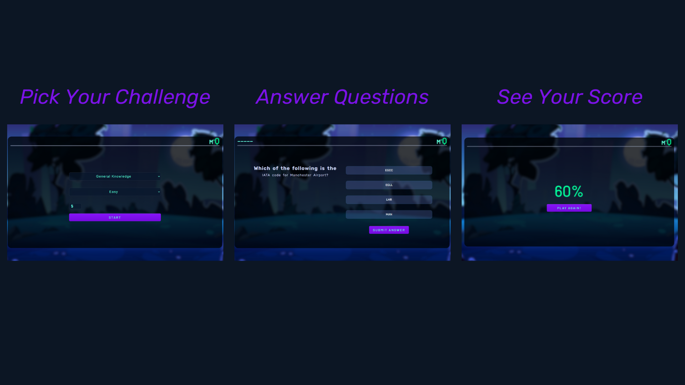

Please Request Permission for Use 🙂

# MultiMindQuiz

Welcome to MultiMindQuiz! This is a simple web-based quiz game designed by me, where users can test their knowledge in various trivia categories.

## Features

### 1. Choose Your Challenge

Select your preferred trivia category from a range of options including history, science, movies, and more.

### 2. Set the Difficulty

Choose the difficulty level that suits you best, whether it's easy, medium, or hard.

### 3. Start the Quiz

Hit the "Start Quiz" button to begin the trivia challenge.

### 4. Test Your Knowledge

Answer multiple-choice questions presented to you one by one. Choose the option you think is correct.

### 5. See Your Score

After answering all questions, see how well you did. The game will calculate your percentage of correct answers.

### 6. Play Again

Want to beat your score or try a different category? Hit the "Play Again" button to restart the quiz.

## How to Use

1. Clone this repository to your local machine.
2. Open the index.html file in your web browser.
3. Select your preferred category, difficulty level, and number of questions.
4. Start the quiz and enjoy testing your knowledge!

## Technologies Used

- HTML
- CSS
- JavaScript

## Credits

- All design and development by Ali Allam, ME😁!

## Contributing

Contributions are welcome! If you have any suggestions or improvements, feel free to open an issue or submit a pull request.

## License

This project is licensed under the MIT License.
